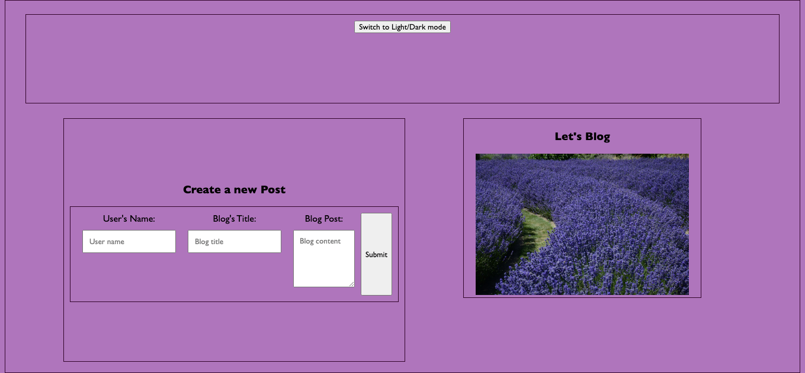
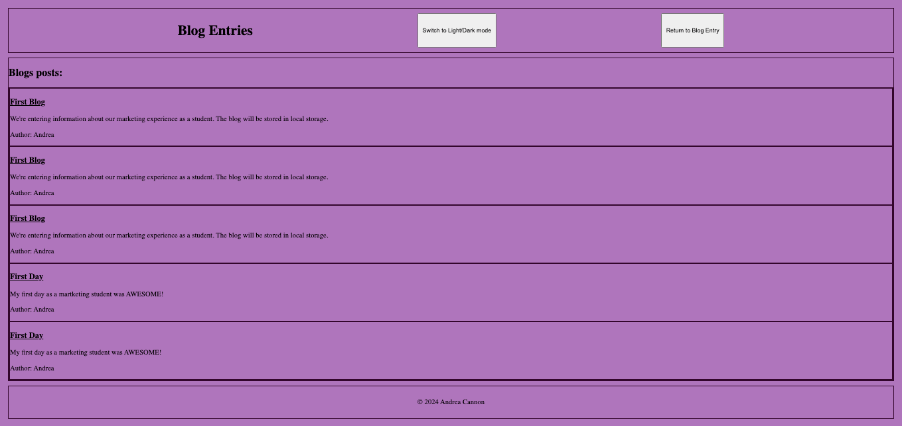

# Personal Blog

## Description
This Personal Blog application is designed for a marketing student to share thoughts and experiences. It allows users to create and store blog posts using localStorage and provides features like light/dark mode, post listing, and form validation. This project was designed for U of MN bootcamp through EdX

## Usage
The application features two pages:

Create a Blog Post: Accessible on the landing page (index.html), where users can input their username, blog title, and blog content.
View Blog Posts: Once the form is submitted, the blog post is saved in localStorage and displayed on the posts page (blog.html). Users can toggle between light and dark modes and navigate back to create more posts.

## How to Create a Blog Post:
Open the index.html page.
Fill in the Username, Blog Title, and Content in the form.
Click the Submit button.
You will be redirected to the blog posts page where you can view your post.

## Key Features:
Form Validation: The form ensures that all fields (username, title, and content) are filled out before submission.
Blog Storage: Blog posts are stored in the browser’s localStorage, meaning your data will persist even after refreshing or closing the browser.
Light/Dark Mode: Users can switch between light and dark mode on the posts page.
Navigation: Users can navigate between the form page and posts page seamlessly.

### Deployed site:
https://andreacannon.github.io/AndreaCannon/

